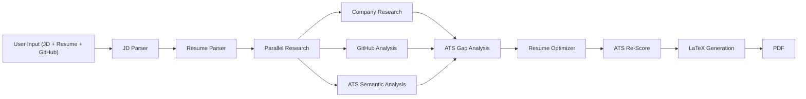

# Resume Agent

AI-powered tailored resume builder with ATS optimization, GitHub analysis, and company research.

## Tech Stack Overview

| Technology | Version | Badge |
|------------|---------|-------|
| [Gemini 2.5 Flash](https://cloud.google.com/vertex-ai/docs/generative-ai/learn/models#gemini-2-5-flash) | 2.5 Flash |  |
| [Pydantic v2](https://docs.pydantic.dev/latest/) | v2 |  |
| [sentence-transformers (all-MiniLM-L6-v2)](https://www.sbert.net/) | all-MiniLM-L6-v2 |  |
| [pdfplumber](https://github.com/jsvine/pdfplumber) | latest |  |
| [PyGithub](https://pygithub.readthedocs.io/) | latest |  |
| [Serper.dev](https://serper.dev/) | latest |  |
| [Jinja2](https://palletsprojects.com/p/jinja/) + [LaTeX](https://www.latex-project.org/) | latest |  |
| [FastAPI](https://fastapi.tiangolo.com/) + [Uvicorn](https://www.uvicorn.org/) | latest |  |
| [Streamlit](https://streamlit.io/) | latest |  |
| [Loguru](https://github.com/Delgan/loguru) | latest |  |

## What It Does

1. **Parses** your job description and resume into structured data
2. **Researches** the target company (tech stack, culture, hiring signals)
3. **Analyzes** your GitHub projects for JD relevance
4. **Scores** your resume against ATS criteria (keyword match + semantic similarity)
5. **Optimizes** weak sections with LLM-powered rewriting
6. **Generates** a professional LaTeX PDF resume

## Tech Stack


## Project Structure

```
resume-agent/
├── src/
│   ├── main.py                          # FastAPI entry point (uvicorn)
│   ├── core/
│   │   ├── config.py                    # Central settings (env vars)
│   │   └── gemini_client.py             # Gemini API wrapper
│   ├── models/
│   │   ├── common.py                    # Base schema, enums
│   │   ├── jd.py                        # JobDescription model
│   │   ├── resume.py                    # ParsedResume model
│   │   ├── github.py                    # GitHubProject model
│   │   ├── ats.py                       # ATSReport model
│   │   └── tailored_resume.py           # TailoredResume model
│   ├── services/
│   │   ├── orchestrator.py              # Pipeline manager
│   │   ├── embeddings.py                # Local embedding service
│   │   ├── latex_resume.py              # LaTeX/Jinja2 renderer
│   │   ├── agents/
│   │   │   ├── jd_parser.py             # JD parsing agent
│   │   │   ├── resume_parser.py         # Resume parsing agent
│   │   │   ├── github_analyzer.py       # GitHub analysis agent
│   │   │   ├── ats_scorer.py            # ATS scoring agent
│   │   │   ├── resume_optimizer.py      # Resume optimization agent
│   │   │   └── company_research.py      # Company research agent
│   │   ├── prompts/                     # LLM prompt templates
│   │   └── templates/
│   │       └── resume.tex.j2            # LaTeX resume template
│   ├── api/
│   │   └── routes.py                    # REST API endpoints
│   └── utils/
│       └── decorators.py                # Reusable retry/logging decorators
├── ui/
│   └── app.py                           # Streamlit frontend
├── docs/                                # Phase documentation
├── pyproject.toml                       # Dependencies & tooling config
└── .env                                 # API keys (not committed)
```

## Setup

```bash
# 1. Clone and enter project
cd resume-agent

# 2. Create virtual environment
python -m venv .venv
.venv\Scripts\activate   # Windows

# 3. Install dependencies
pip install -e .

# 4. Configure environment
# Edit .env with your API keys:
#   GEMINI_API_KEY=your_key
#   GITHUB_TOKEN=your_token      (optional)
#   SERPER_API_KEY=your_key      (optional)
```

## Running

### API Server
```bash
cd src
uvicorn main:app --reload --port 8000
```

### Streamlit UI
```bash
streamlit run ui/app.py
```

### API Endpoints

| Method | Endpoint | Description |
|--------|----------|-------------|
| GET | `/api/health` | Health check |
| POST | `/api/parse-jd` | Parse a job description |
| POST | `/api/parse-resume/text` | Parse resume from text |
| POST | `/api/parse-resume/pdf` | Parse resume from PDF upload |
| POST | `/api/generate` | Full pipeline (text inputs) |
| POST | `/api/generate/upload` | Full pipeline with PDF upload |

## Architecture

