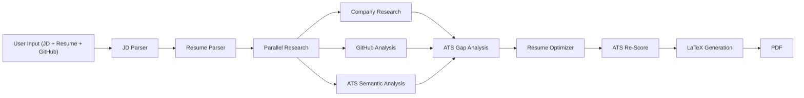

<h1 align="center"> Resume Builder and Optimizer Agent </h1>

<p align="center">
  
  
  
  
  
  
</p>
<p align="center">
  
  
  
  
  
  
</p>
<p align="center">
  
  
</p>

<p align="center">
  Resume Builder Agent is an AI-powered multi-agent system that automates the process of creating tailored, ATS-optimized resumes for specific job opportunities. By combining job description analysis, resume parsing, GitHub project evaluation, company research, semantic ATS scoring, and LLM-driven content optimization, the platform generates highly relevant and professional resumes aligned with employer requirements.

Built with FastAPI, Streamlit, Gemini, Pydantic, and Sentence Transformers, the system leverages specialized AI agents working together through an orchestration pipeline to identify skill gaps, improve resume content, and produce polished LaTeX-based PDF resumes. The goal is to help candidates maximize resume relevance, ATS compatibility, and overall application quality with minimal manual effort.
</p>

## What It Does

1. **Parses** your job description and resume into structured data
2. **Researches** the target company (tech stack, culture, hiring signals)
3. **Analyzes** your GitHub projects for JD relevance
4. **Scores** your resume against ATS criteria (keyword match + semantic similarity)
5. **Optimizes** weak sections with LLM-powered rewriting
6. **Generates** a professional LaTeX PDF resume

## Project Structure

```
resume-agent/
├── src/
│   ├── main.py                          # FastAPI entry point (uvicorn)
│   ├── core/
│   │   ├── config.py                    # Central settings (env vars)
│   │   └── gemini_client.py             # Gemini API wrapper
│   ├── models/
│   │   ├── common.py                    # Base schema, enums
│   │   ├── jd.py                        # JobDescription model
│   │   ├── resume.py                    # ParsedResume model
│   │   ├── github.py                    # GitHubProject model
│   │   ├── ats.py                       # ATSReport model
│   │   └── tailored_resume.py           # TailoredResume model
│   ├── services/
│   │   ├── orchestrator.py              # Pipeline manager
│   │   ├── embeddings.py                # Local embedding service
│   │   ├── latex_resume.py              # LaTeX/Jinja2 renderer
│   │   ├── agents/
│   │   │   ├── jd_parser.py             # JD parsing agent
│   │   │   ├── resume_parser.py         # Resume parsing agent
│   │   │   ├── github_analyzer.py       # GitHub analysis agent
│   │   │   ├── ats_scorer.py            # ATS scoring agent
│   │   │   ├── resume_optimizer.py      # Resume optimization agent
│   │   │   └── company_research.py      # Company research agent
│   │   ├── prompts/                     # LLM prompt templates
│   │   └── templates/
│   │       └── resume.tex.j2            # LaTeX resume template
│   ├── api/
│   │   └── routes.py                    # REST API endpoints
│   └── utils/
│       └── decorators.py                # Reusable retry/logging decorators
├── ui/
│   └── app.py                           # Streamlit frontend
├── docs/                                # Phase documentation
├── pyproject.toml                       # Dependencies & tooling config
└── .env                                 # API keys (not committed)
```

## Tech Stack Overview

| Technology | Version | Usage in Project |
|------------|---------|-----------------|
| [google-generativeai](https://ai.google.dev/) | ≥ 0.3.0 | LLM backbone — all agents (JD parser, resume parser, ATS scorer, optimizer, company research, GitHub analyzer) call Gemini 2.5 Flash via `gemini_client.py` |
| [Pydantic v2](https://docs.pydantic.dev/latest/) | ≥ 2.5.0 | Strict schema validation for all data models — `JobDescription`, `ParsedResume`, `ATSReport`, `TailoredResume`, `GitHubProject` |
| [pydantic-settings](https://docs.pydantic.dev/latest/concepts/pydantic_settings/) | ≥ 2.1.0 | Loads and validates environment variables (`GEMINI_API_KEY`, `GITHUB_TOKEN`, `SERPER_API_KEY`) in `core/config.py` |
| [pdfplumber](https://github.com/jsvine/pdfplumber) | 0.11.9 | Extracts raw text from uploaded resume PDFs in `services/agents/resume_parser.py` |
| [PyGithub](https://pygithub.readthedocs.io/) | ≥ 2.1.1 | Fetches user repos, README content, and language stats from the GitHub API in `services/agents/github_analyzer.py` |
| [requests](https://requests.readthedocs.io/) | ≥ 2.31.0 | Makes HTTP calls to the Serper.dev search API for company research in `services/agents/company_research.py` |
| [sentence-transformers](https://www.sbert.net/) | ≥ 2.2.0 | Generates `all-MiniLM-L6-v2` embeddings for semantic ATS keyword similarity scoring in `services/embeddings.py` |
| [numpy](https://numpy.org/) + [scikit-learn](https://scikit-learn.org/) | ≥ 1.26.0 / ≥ 1.3.0 | Cosine similarity computation between resume and JD embeddings in `services/embeddings.py` |
| [Jinja2](https://palletsprojects.com/p/jinja/) | ≥ 3.1.2 | Renders the `resume.tex.j2` LaTeX template with tailored resume data in `services/latex_resume.py` |
| [FastAPI](https://fastapi.tiangolo.com/) + [Uvicorn](https://www.uvicorn.org/) | ≥ 0.109.0 / ≥ 0.25.0 | REST API server exposing `/api/parse-jd`, `/api/generate`, `/api/generate/upload` endpoints in `src/api/routes.py` |
| [aiohttp](https://docs.aiohttp.org/) | ≥ 3.9.0 | Async HTTP client used in the pipeline orchestrator for concurrent agent calls |
| [Streamlit](https://streamlit.io/) | ≥ 1.30.0 | Full interactive web UI — job description input, PDF upload, result display, and download in `ui/app.py` |
| [Loguru](https://github.com/Delgan/loguru) | ≥ 0.7.2 | Structured logging across all modules (API, agents, orchestrator, UI) |
| [tenacity](https://tenacity.readthedocs.io/) | ≥ 8.2.3 | Exponential-backoff retry logic for Gemini API calls in `utils/decorators.py` |


## Setup

```bash
# 1. Clone and enter project
cd resume-agent

# 2. Create virtual environment
python -m venv .venv
.venv\Scripts\activate   # Windows

# 3. Install dependencies
pip install -e .

# 4. Configure environment
# Edit .env with your API keys:
#   GEMINI_API_KEY=your_key
#   GITHUB_TOKEN=your_token      (optional)
#   SERPER_API_KEY=your_key      (optional)
```

## Running

### API Server
```bash
cd src
uvicorn main:app --reload --port 8000
```

### Streamlit UI
```bash
streamlit run ui/app.py
```

### API Endpoints

| Method | Endpoint | Description |
|--------|----------|-------------|
| GET | `/api/health` | Health check |
| POST | `/api/parse-jd` | Parse a job description |
| POST | `/api/parse-resume/text` | Parse resume from text |
| POST | `/api/parse-resume/pdf` | Parse resume from PDF upload |
| POST | `/api/generate` | Full pipeline (text inputs) |
| POST | `/api/generate/upload` | Full pipeline with PDF upload |

## Architecture



## Future Improvements
1. Multiple Resume Templates & Themes
2. Direct LaTeX (.tex) Download Support
3. One-Click PDF Resume Export
4. Cover Letter Generation
5. LinkedIn Profile Optimization
6. Automated Job Matching & Recommendations